# 刻度 · UI 与交互改造

## 2026-09-15：人生纵向计时器与伸缩导航

人生主图由原子点阵改为总天数与纵向的小时、分钟、秒计时器，直接置于页面背景。正面「生之时」用暖琥珀色累计，背面「死之时」用冷青色倒数；8 位小数年龄与百分比作为顶部次级读数。

### 实现约定

- 每层数字上方标单位、下方呈现横向刻度，中央读数线固定、边缘渐隐；小时和分钟较小，秒数最大并附一位小数。秒、分、时刻度按真实时间以 60 倍速度差推进，循环边界不跳回。
- 正面从生日午夜累计，背面向目标生日午夜倒数，使用同一组时间锚点。计时器的一天固定为 24 小时，夏令时不造成时长跳变；8 位年龄继续按真实生日区间计算，闰日生日沿用非闰年二月二十八日规则。
- 实际进位和倒数借位触发两层间短暂的连接亮光；启动、翻面、恢复及时间调整不补播。背面到期归零停止，正面继续累计。
- 数字每 0.1 秒取实际时间；独立 Canvas 时间线最高 30fps，仅画可见刻度，动画帧不查询 SwiftData 或计算日历。设置遮挡、离开人生页或进入后台即暂停。
- 轻点计时区域约 0.5 秒三维翻面，状态、颜色、方向在中点切换；轻扫保留四尺度导航。减少动态效果下静止刻度、不画刻度数字和进位亮光，保留实时数字，翻面改为淡入淡出。
- 底部仅两个玻璃形状。人生页左侧为约 96pt 的图标＋文字，其他尺度收为 58pt 圆钮；右侧年月日／设置一体胶囊同步伸缩，入口始终直接可用。拖动仅选择年月日，设置仍是弹层，不成为第五尺度。
- iOS 26 使用原生 GlassEffectContainer、交互玻璃和稳定 glassEffectID；iOS 18–25 材质降级，减少动态效果直接切换尺寸。持久化字段、年月日图形和旧每周刻点兼容规则保持不变。

### 本轮验证

独立 iPhone SE 第三代 / iOS 26.3 完整回归 **48 项通过（32 核心 + 16 UI），0 失败、0 跳过**。标准 iPhone 17 Pro 同一轮 47 项通过，导航宽度测试的矩形键路径读取失败；实际导航收缩正确，测试已改为直接读取控件宽度，并在紧凑屏完整回归和标准屏单项复测中通过。

视觉审阅后进一步缩小紧凑布局的小时／分钟／秒字体，调整刻度标签和连接线间距，避免相邻层文字贴近。调整后重新完成 32 项核心测试和 4 项相关 UI 检查（双面数字、最大辅助字号、导航伸缩、减少动态效果），36 项全部通过；标准屏导航单项复测也通过。

### 当前运行证据

| 生之时 · 标准屏石墨 | 死之时 · 标准屏石墨 |
| --- | --- |
| 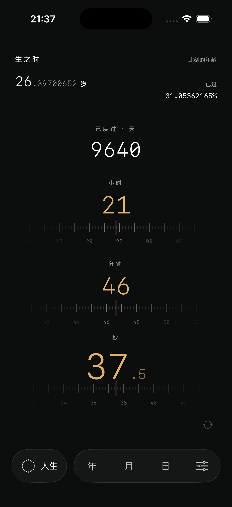 | 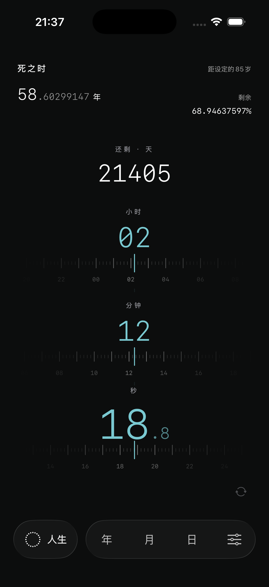 |

[31 秒交互节选](2026-09-15-timer/timer-highlights.mp4)展示刻度流动、导航收缩／展开、三维翻面与真实倒数借位。节选只删去等待，各段均为原速；[103 秒连续原速录屏](2026-09-15-timer/timer-standard.mp4)保留完整过程，约第 82 秒可见秒／分钟借位和短暂连接亮光。没有使用加速时钟或演示进度。

| 生之时 · 紧凑屏 | 死之时 · 紧凑屏 |
| --- | --- |
| 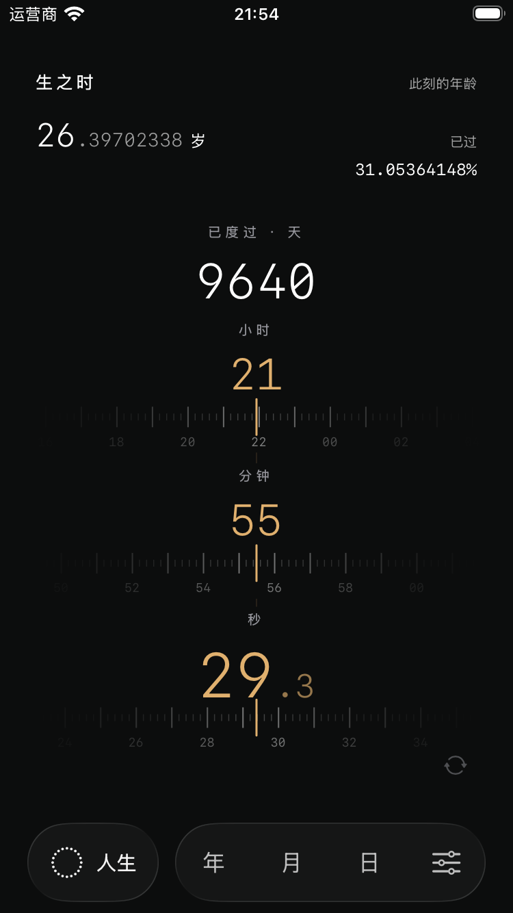 | 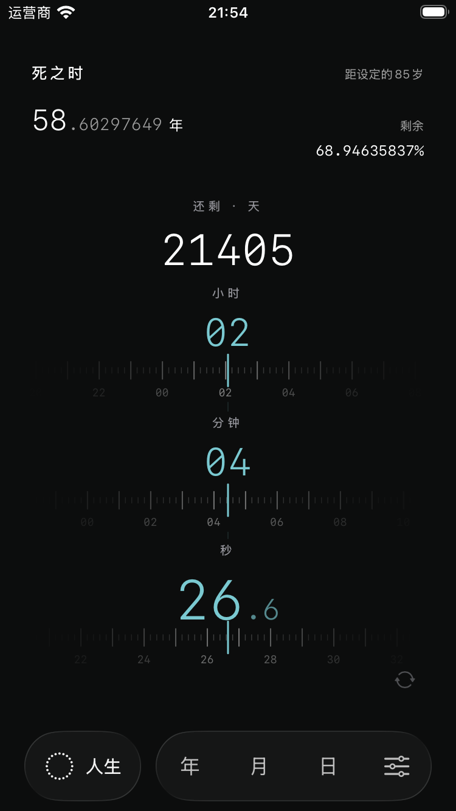 |

[紧凑屏原速运行录屏（18 秒）](2026-09-15-timer/timer-compact.mp4)。

[年度导航收缩状态](2026-09-15-timer/standard-navigation-year.png)、[紧凑屏暖纸／最大辅助字号](2026-09-15-timer/compact-life-paper-large-text.png)、[紧凑屏减少动态效果](2026-09-15-timer/compact-life-reduce-motion.png)、[紧凑屏日视图](2026-09-15-timer/compact-instrument-after-scroll.png)。大字号时主内容可滚动，导航固定在底部。

辅助功能标签、按钮动作和前后台恢复已由 UI 回归覆盖，不逐秒自动播报。生命周期条件同时控制数字任务与 Canvas 暂停；未做真机能耗测量。系统 VoiceOver 实际朗读与 iOS 18 运行时未实测。

## 历史版本：2026-09-15 第一版原子时钟

当前界面以时间数字、可视化主图和底部导航组成。默认尺度为人生，随后依次为年、月、日。原顶部品牌、标语、操作按钮、数字下方计数、交互提示、刻点胶囊、阶段说明和尺度对比已从主屏移除。

### 设计与行为

- **底部导航**：左侧独立人生圆钮使用 `circle.dotted`，中间年月日胶囊支持点击和拖动，右侧独立设置圆钮使用 `slider.horizontal.3`。人生选中时年月日均不选中。主图左右轻扫切换四尺度。
- **液态玻璃**：iOS 26 使用原生玻璃容器、交互玻璃和移动选中态，三个外形静止时保持分离；iOS 18–25 使用材质降级。
- **人生数字**：正面「生之时」展示实际小数年龄和已过百分比，背面「死之钟」展示距设定年龄的剩余年数与百分比。两个数值均保留 8 位小数，使用等宽数字，整数更突出、小数更轻。
- **人生原子**：规则点阵固定 96 列，行数按卡片比例限制在 96–180 行。每颗原子表示等量人生时间，完成与剩余区域按阅读顺序排列；当前原子填充对应真实进度，局部微光提供秒级变化。
- **翻面**：轻点整卡进行约 0.5 秒的水平三维翻转，顶部文字在中点切换；背面保持坐标，明暗与微光方向互换。同一次使用保持翻面状态，重启默认正面；减少动态效果下使用淡入淡出。
- **颜色**：人生使用中性色；深色为白／灰原子，浅色为深墨／浅灰原子。年月日继续保留其各自的时间图形与刻点标记。
- **刻点入口与历史数据**：刻点集从设置进入，继续支持搜索、增删改。周尺度、周起始设置入口和新建每周规则移除；月历保留星期标签并遵守已有偏好。旧每周刻点保留在「历史刻点」，编辑普通字段不会改变其规则，选择新的有效重复规则后才转换。

### 时间计算与实现约定

小数年龄按两个实际生日之间的区间计算；2 月 29 日出生者在非闰年以 2 月 28 日为生日。剩余年数为设定年龄减去小数年龄，百分比使用出生日至目标生日的真实时长，正反面百分比互补。超过设定年龄后年龄继续增长，剩余值为零，进度为 100%，边界微光停止。

人生实时视图与年月日日历计算分离。每 0.1 秒读取实际时间只在人生可见且应用处于前台时进行，被弹层遮挡、切换尺度或进入后台后暂停；恢复时直接跳到当前时间。Canvas 缓存点阵布局和静态区域，只更新当前原子和局部微光，不创建成千上万个 SwiftUI 子视图。

原有 SwiftData 字段与历史每周原始值保留，无破坏性数据迁移。应用继续完全离线，最低系统版本仍为 iOS 18。

### 本轮验证结果

独立标准模拟器 `Kedu Design QA`（iPhone 17 Pro / iOS 26.3）Debug 构建与启动成功，29 条核心测试通过。UI 首轮回归发现两项问题；修复后，受影响路径及新增的减少动态效果用例复测通过。

最终完整回归在独立紧凑模拟器 `Kedu Compact QA`（iPhone SE 第三代 / iOS 26.3）完成：**43 项通过（29 条核心测试 + 14 条 UI 测试），0 失败、0 跳过。**

| 验证项 | 结果与边界 |
| --- | --- |
| 时间、生日、时区、原子布局与规则兼容 | 29 条核心测试通过 |
| 四尺度、翻面、实时数字、设置内刻点与历史转换 | 14 条 UI 测试通过；旧每周记录编辑保留规则，显式选择新规则后转换 |
| 紧凑屏、最大辅助字号、浅深外观、减少动态效果 | 完成回归与截图检查，导航与翻面可用 |
| 辅助功能 | 标签与动作已检查；未开启系统 VoiceOver 实测朗读 |
| 设置遮挡、后台暂停与恢复 | 标准模拟器手动检查通过；恢复时读取实际时间 |
| iOS 18 材质降级 | 编译通过；未在 iOS 18 运行时实测 |
| 人生秒级变化与翻转 | 已保存标准屏 28 秒、紧凑屏 23 秒录屏及正反面截图 |

标准模拟器在设置和后台静置时，CPU 采样均为 0；这只是对刷新暂停行为的观察，不是性能基准，也不代表真机能耗测量。

### 当前截图与录屏

以下来自本轮独立 iOS 26.3 模拟器运行，使用内存演示数据；数字会随运行时间变化。

| 生之时 · 标准屏石墨 | 死之钟 · 标准屏石墨 |
| --- | --- |
| 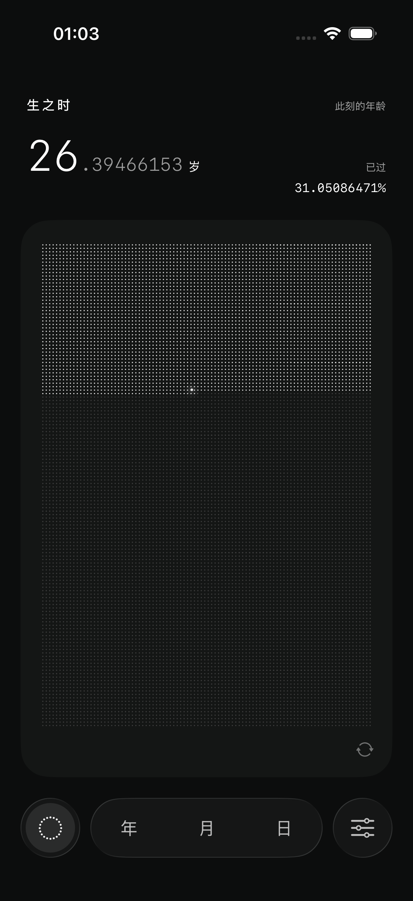 | 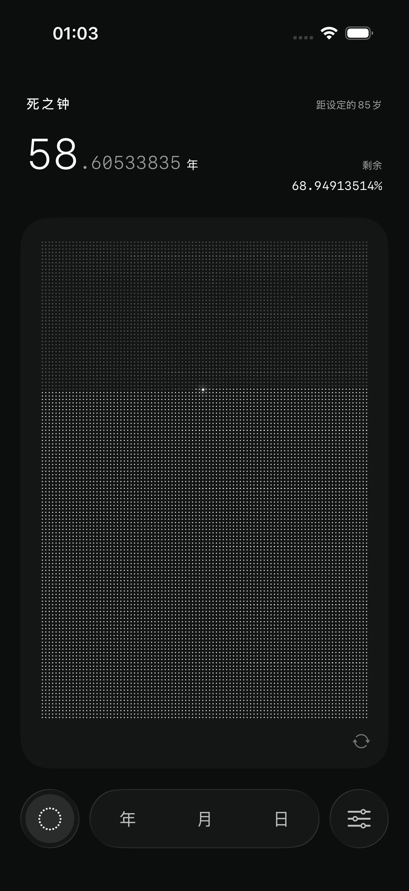 |

[标准屏人生秒级变化与翻转（28 秒）](2026-09-15/life-flip-standard.mp4)、[紧凑屏人生秒级变化与翻转（23 秒）](2026-09-15/life-flip-compact.mp4)。

| 人生 · 紧凑屏石墨 | 人生 · 紧凑屏暖纸／最大辅助字号 | 设置 · 紧凑屏暖纸／最大辅助字号 |
| --- | --- | --- |
| 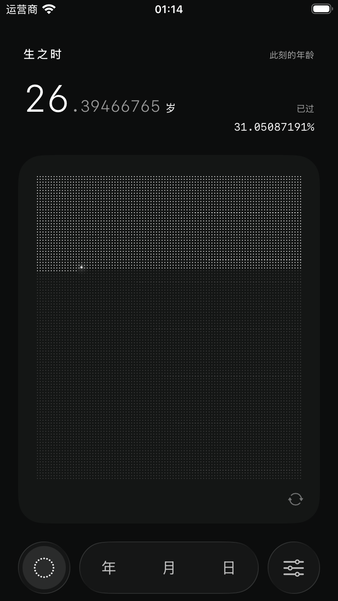 | 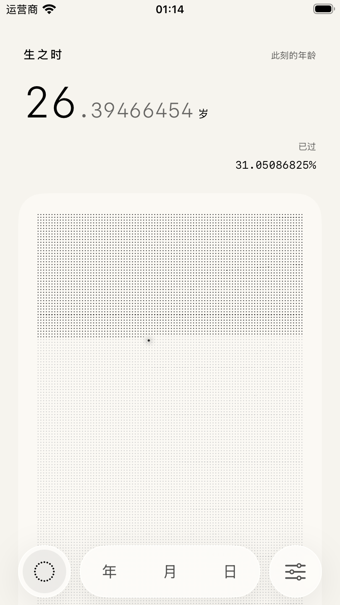 | 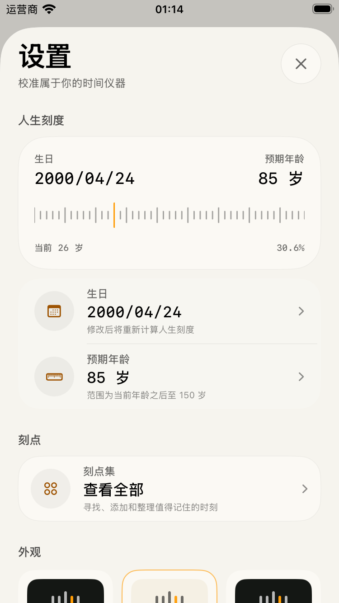 |

补充检查：[紧凑屏日视图](2026-09-15/compact-day.png)、[紧凑屏减少动态效果](2026-09-15/compact-life-reduce-motion.png)。

本轮不涉及发布、签名和商店素材重制。下方 2026-09-08 旧截图包含已经移除的品牌、周尺度和信息区，只用于历史回顾。

### 继续开发

使用 `Kedu.xcodeproj` 的 `Kedu` scheme。UI 测试启动参数 `-uiTesting -uiTestingSeeded` 使用内存个人资料；`-uiTestingSeedEvent` 增加年度生日刻点，`-uiTestingSeedWeeklyEvent` 增加兼容测试用历史每周刻点，`-uiTestingReduceMotion` 在测试中覆盖减少动态效果环境，不写入真实用户数据。

稳定自动化入口包括 `scale.life/year/month/day`、`settings.button`、设置内 `events.library`、`events.add/search/row.<title>`、编辑器 `event.*`，以及人生 `life.flip/face/age/progress`。数字的辅助功能值保留纯数字和 8 位小数，方便测试真实秒级变化，不逐秒自动播报。

## 历史记录：2026-09-08

以下保留当时的设计、实际截图与测试结论，方便理解项目演进。其中五尺度、顶部刻点入口和旧人生卡片已被上述 2026-09-15 设计替代。

2026-09-08。目标是让刻度更像一件清晰、安静的个人时间仪器。五种时间尺度、本地隐私和原有刻点规则继续保留。

### 这一轮的设计

- **主屏**：新增刻度形品牌标记，统一顶部操作按钮；放大主数值，对齐百分比；用面板、留白和图例区分信息层级。
- **年度点阵**：按十二个月分组，每月按日期顺序排列，保留全年每一天与刻点的准确位置，兼容闰年。
- **五尺度**：保留连续形变和触觉切换；阶段信息、剩余时间和相邻尺度进度重新排版。小屏和大字号下主内容可以滚动，底部尺度导航保持可用。
- **刻点集**：从右上角叠层按钮进入。按尺度分组、搜索名称、编辑任意刻点、添加刻点，并提供空状态与搜索无结果状态。
- **外观**：设置中提供「跟随系统 / 暖纸 / 石墨」，偏好保存在本机。实体面板承载内容，悬浮导航保留系统玻璃效果。浅色强调文字使用更深的琥珀色。
- **首次设置**：以原生日期选择代替逐年、逐月点击；保留年龄刻度，明确预期年龄只是可调整的参照。保存失败提供提示。
- **细节修复**：月、周的可见星期标签遵守周起始日与计算时区；减少动态效果时导航拖动直接吸附；相对天数按自然日计算；刻点保存或删除失败时回滚，允许安全重试；系统日期控件使用中文。

### 实际截图

截图来自独立的 iOS 26.3 模拟器，使用内存演示数据。它们是运行结果，不是设计稿。时间会随运行时间变化。

| 年 · 石墨 | 月 · 石墨 | 日 · 暖纸 |
| --- | --- | --- |
| 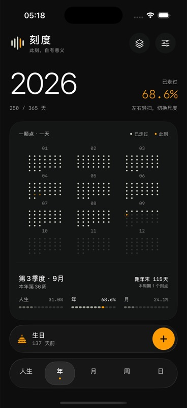 | 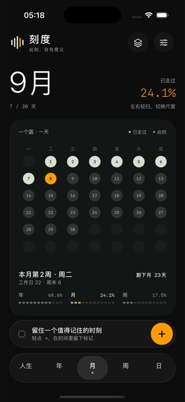 | 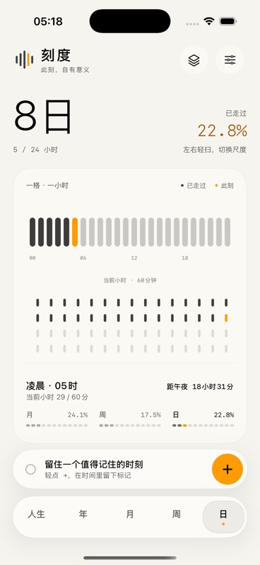 |

| 人生 | 周 | 首次设置 |
| --- | --- | --- |
| 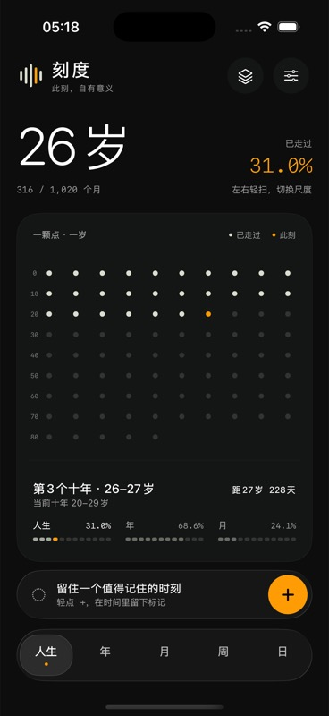 | 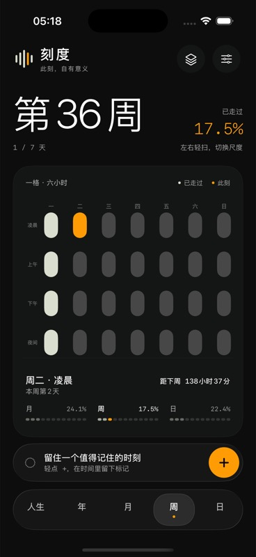 | 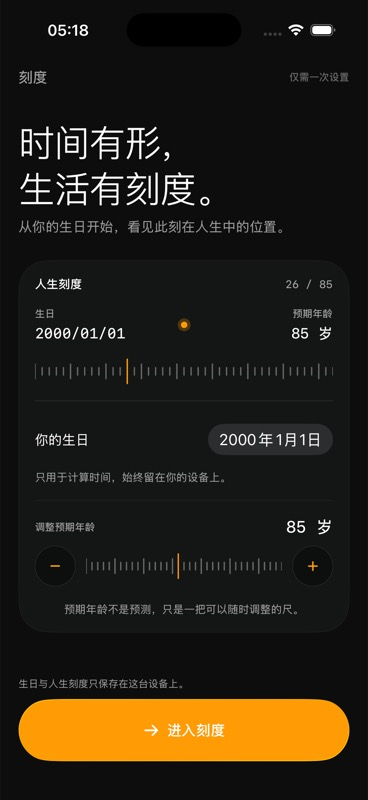 |

| 刻点集 | 设置 | 编辑刻点 |
| --- | --- | --- |
| 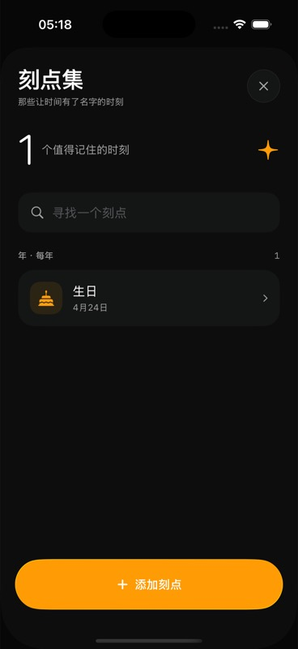 | 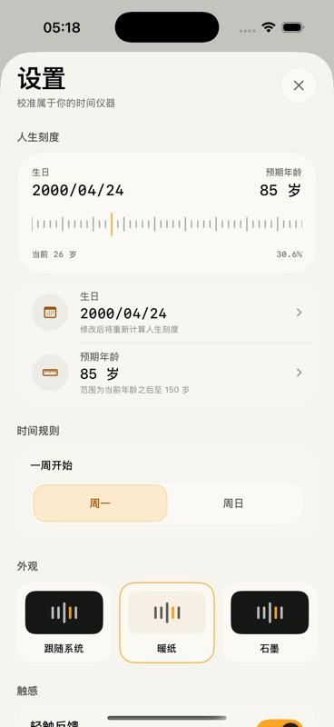 | 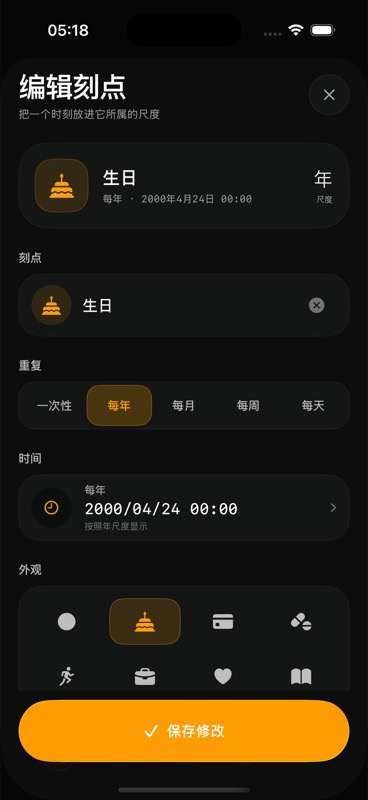 |

小屏实测：[iPhone SE 日视图](compact-day.jpg)。主内容可滚动，分钟刻度按可用高度排布，导航固定在底部。

原版留档：[改造前的年度视图](before-year.jpg)。

### 验证记录

- iPhone 17 Pro / iOS 26.3 独立模拟器：Debug 构建、启动通过。
- 完整回归：17 条原有核心测试 + 8 条 UI 测试通过，0 失败。
- 随后补充星期标签及时区、闰年分月布局检查，19 条核心测试全部通过。
- 8 条 UI 测试覆盖引导、刻点增删、编辑器、设置、五尺度点击与拖动，以及新增的搜索后编辑和最大辅助字号下的外观切换与返回。
- 完成强调文字颜色和中文日期调整，重新构建并逐屏检查截图。
- iPhone SE（第三代）/ iOS 26.3：修正紧凑高度下分钟刻度重叠，20 条核心与布局测试以及新增的滚动后导航可用性 UI 测试通过。累计 20 条核心与布局、9 条 UI 测试通过。
- 首轮共享模拟器测试有 2 项失败：一项读取动画未结束的界面，一项运行录像显示中途切换至其他 App。前者改为等待目标视图，后者改用独立模拟器；之后完整回归通过。

本轮没有改变 SwiftData 数据模型、增加网络请求或外部依赖。应用仍然完全离线。本目录是开发审阅材料；原有 StoreAssets 截图尚未替换，发布前应重新生成正式商店素材并做真机检查。

### 接着开发

打开 `Kedu.xcodeproj`，使用 `Kedu` scheme。独立模拟器名为 `Kedu Design QA`；演示启动参数 `-uiTesting -uiTestingSeeded -uiTestingSeedEvent` 使用内存数据，不写入用户的实际记录。

新增屏幕在 `Kedu/UI/Screens/EventLibraryView.swift`；颜色与外观选项在 `Kedu/Core/AppTheme.swift`；五尺度呈现在 `MainClockView.swift` 与 `DotMatrixView.swift`。
