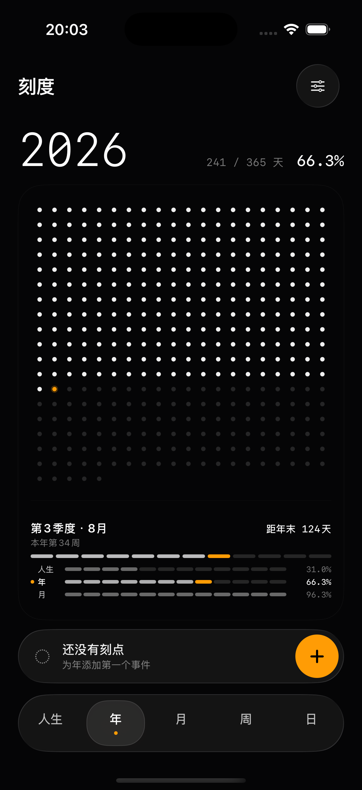

# 刻度 · LifeClock

一块安静、私密的个人时间仪表。

刻度把人生、年、月、周和日转换成五种可以直接感知的视图。它不试图催促时间，只负责标出此刻的位置，并为值得记住的时刻留下刻点。



## 功能

- 人生、年、月、周、日五种时间尺度
- 一次性、每年、每月、每周和每天重复的刻点
- 本地新增、编辑与删除
- 深色与浅色外观
- 动态字体、减少动态效果和 VoiceOver 支持
- 无账号、无广告、无网络请求、无第三方 SDK

生日、预期年龄、偏好设置和所有刻点仅保存在设备本地。

## 技术栈

- Swift 6
- SwiftUI
- SwiftData
- Swift Testing 与 XCTest
- XcodeGen
- 最低系统版本：iOS 18

## 项目结构

```text
Kedu/
├── App/                 App 入口、根视图与预览数据
├── Core/                时间计算、主题与触觉反馈
├── Models/              SwiftData 模型与尺度定义
├── Resources/           图标、本地化与隐私清单
└── UI/
    ├── Components/      点阵与通用控件
    └── Screens/         引导、主时钟、事件与设置
KeduTests/               核心时间逻辑测试
KeduUITests/             关键用户流程测试
StoreAssets/             App Store 文案与正式素材
```

## 本地开发

### 环境

- Xcode 26 或兼容版本
- XcodeGen
- 支持 iOS 18 或更高版本的模拟器

### 生成工程

仓库已经包含可直接打开的 `Kedu.xcodeproj`。修改 `project.yml` 后，可以重新生成工程：

```sh
xcodegen generate
```

### 构建

```sh
xcodebuild \
  -project Kedu.xcodeproj \
  -scheme Kedu \
  -destination 'platform=iOS Simulator,name=iPhone 17 Pro' \
  build
```

### 测试

```sh
xcodebuild \
  -project Kedu.xcodeproj \
  -scheme Kedu \
  -destination 'platform=iOS Simulator,name=iPhone 17 Pro' \
  test
```

当前基线包含 17 条核心测试和 6 条 UI 测试，覆盖日期边界、夏令时、五尺度展示、首次引导、设置以及刻点的新增、编辑和删除。

## 隐私

刻度完全离线运行，不收集、不上传、不共享个人数据，也不申请通讯录、日历、照片、位置、健康、麦克风、相机或通知权限。

隐私声明与上架材料位于 [`StoreAssets`](StoreAssets/README.md)。

## 许可证

本项目使用 [MIT License](LICENSE)。
